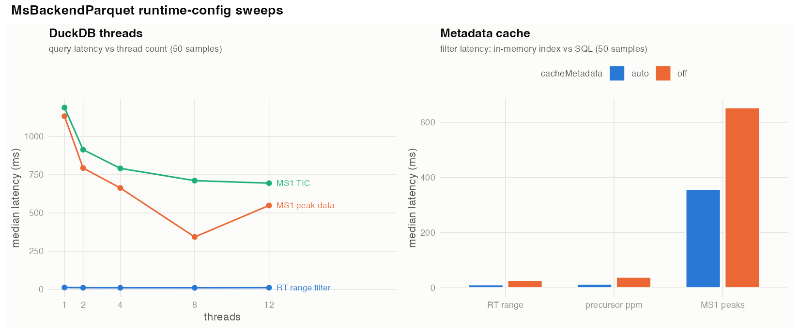
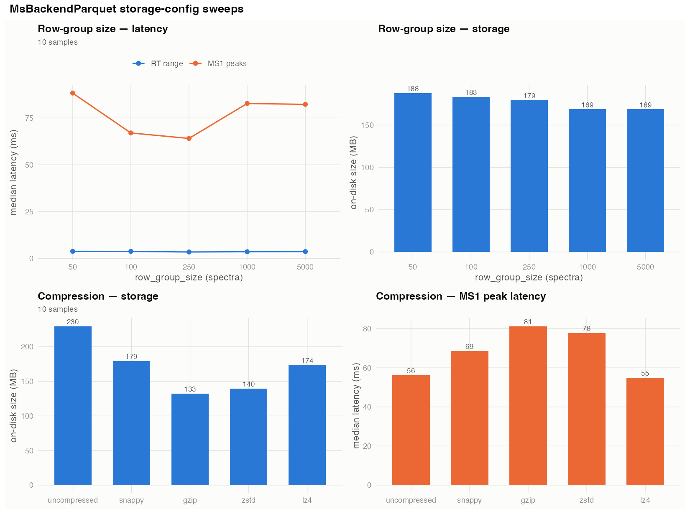

---
output:
  pdf_document:
    latex_engine: pdflatex
    pandoc_args:
      - "-V"
      - "colorlinks=true"
      - "-V"
      - "urlcolor=blue"
      - "-V"
      - "linkcolor=blue"
  html_document: default
---

# Performance considerations

This document explains the performance considerations in `MsBackendParquet`.
The four benchmark scripts in this directory measure the result:
`benchmark-spectraql-multifile.R` runs an end-to-end query suite against the
other on-disk backends, `microbench.R` times individual operations,
`benchmark-sweeps.R` varies the tunable options one axis at a time, and
`benchmark-mzpeak.R` measures the mzPeak archive path (ingest, index size and
peak search with and without a projection).

## Connection and session management

`R/duckdb-connection.R`

- **One persistent, lazy [DuckDB](https://duckdb.org/) connection per process.** A single `:memory:`
  connection is created on first use and reused by every read (`.duckdb_con()`).
  *Why:* a `:memory:` connection has no file overhead and DuckDB serialises
  queries internally, so re-opening a connection per query only adds startup
  cost. See [DuckDB's concurrency model](https://duckdb.org/docs/stable/connect/concurrency).
- **Fork-safe process-id guard.** The connection is keyed by the pid that
  created it; a forked parallel worker transparently opens its own instead of
  reusing (or shutting down) the parent's. *Why:* `dbIsValid()` returns `TRUE`
  for a handle inherited across a fork even though the DuckDB instance belongs
  to the parent, so disconnecting from a child would tear down the parent's
  database.
- **One-time session configuration** (`.duckdb_configure()`). [`SET
  parquet_metadata_cache = true`](https://duckdb.org/docs/stable/configuration/overview) is applied once per connection; optional [`SET
  threads`](https://duckdb.org/docs/stable/configuration/overview) / [`SET memory_limit`](https://duckdb.org/docs/stable/configuration/overview) are applied when the corresponding options are
  set. *Why:* without the metadata cache DuckDB re-decodes the [Thrift](https://thrift.apache.org/)
  (binary protocol) footer of every [Parquet](https://parquet.apache.org/) file on every query;
  per-query overhead that grows with the number of files.
- **[`preserve_insertion_order`](https://duckdb.org/docs/stable/configuration/overview) is deliberately left ON.** *Why:* every fetch
  must return rows in `spectraIds` order. Disabling it scrambles rows and forces
  a `match()` reindex in R that costs more than the ordering DuckDB would have
  avoided. DuckDB's advice to disable it targets [larger-than-memory bulk load](https://duckdb.org/docs/stable/guides/performance/how_to_tune_workloads), not ordered point fetches.
- **Per-dataset view registry.** The DuckDB view over a dataset's Parquet files
  is created once per normalised path and cached (`.dataset_view()`); later
  accesses are a bare environment lookup. *Why:* avoids re-issuing `CREATE VIEW
  ... read_parquet(...)` and re-normalising the path on every query.
- **Cheap cached identifier quoting** (`.quote_ident()`). Well-behaved ASCII
  column names are validated once and wrapped from a cache, falling back to
  [`DBI::dbQuoteIdentifier()`](https://dbi.r-dbi.org/reference/dbQuoteIdentifier.html) only for unusual names. *Why:* avoids S4 dispatch on
  the hot query path.

## On-disk storage layout

`R/MsBackendParquet-functions.R`, `R/MsBackendParquet.R`

- **Columnar Parquet, peaks as `list<double>` columns.** `mz` and `intensity`
  are stored as nested list columns (one list per spectrum) alongside the
  metadata columns and an integer `spectrum_id_` primary key. *Why:* the
  columnar layout lets a query read only the columns it needs and skip data
  pages via row-group statistics, while the list column keeps one row per
  spectrum and fetches a whole peak array in a single columnar read.
- **[Snappy](https://github.com/google/snappy) compression, row-group size 250.** *Why:* snappy is fast and widely
  supported; the row-group size trades pruning granularity against
  metadata/compression overhead: smaller groups prune narrow range queries
  (e.g. rtime) more finely, larger groups compress better.
- **Optional [Hive partitioning](https://duckdb.org/docs/stable/data/partitioning/hive_partitioning)** (e.g. by `dataOrigin`). *Why:* lets DuckDB
  prune whole partitions for access patterns that filter on the partition key.

## Read path

`R/MsBackendParquet.R`, `R/MsBackendParquet-functions.R`, `R/duckdb-connection.R`

- **Lazy object: path + integer keys only.** The backend stores the dataset path
  and an integer vector of `spectrum_id_` keys; subsetting and merging only
  manipulate that vector and never touch disk. *Why:* keeps objects small and
  fully serialisable across `saveRDS`/parallel workers, and defers materialising
  peaks until requested.
- **Projection pushdown.** SQL `SELECT`s list only the requested columns (plus
  `spectrum_id_`); each peak column is fetched independently and a single-column
  peak request is more performant than the full matrix build.
  *Why:* avoids reading and
  materialising columns (especially the large peak lists) that the caller did
  not ask for.
- **Predicate pushdown.** Filters (`filterRt`, `filterMsLevel`,
  `filterPrecursorMz*`, ...) are rendered as SQL `WHERE` predicates. *Why:* DuckDB
  prunes row groups using their min/max statistics instead of scanning every
  spectrum. See [DuckDB's Parquet performance guide](https://duckdb.org/docs/stable/guides/performance/file_formats) on row-group skipping.
- **"Clean predicate" carry-forward.** When a backend's surviving ids are
  exactly described by a filter predicate, the predicate (not a long
  `spectrum_id_ IN (...)` list) is stored and pushed down on the next fetch;
  chained filters AND-combine and evaluate in a single scan. *Why:* keeps SQL
  text small and lets DuckDB keep pruning on predicate columns.
- **Id-restriction strategy by shape** (`.ids_where()`). A contiguous ascending
  run becomes `spectrum_id_ BETWEEN lo AND hi` (answerable from row-group
  stats); an arbitrary set up to 1024 ids becomes `IN (...)`; a larger set is
  registered as a temporary DuckDB table and joined. *Why:* past ~1024 ids the
  SQL text itself becomes the bottleneck (hundreds of KB to build in R and
  re-parse in DuckDB), and the registered table also carries the ordering so the
  reorder happens DuckDB-side.
- **Schema cached on the object; `LIMIT 0` schema probes.** The dataset's
  variable names are read once at init and reused; when the schema must be
  queried, `SELECT * ... LIMIT 0` fetches names without reading a data page. *Why:*
  avoids per-fetch round trips and full scans just to learn column names.
- **Ordered fast path.** When DuckDB returns rows already in `spectraIds` order,
  the R-side `match()` reorder is
  skipped (`.reorder_to_ids()`). *Why:* avoids an O(n) hash match plus a full
  reindex of the peak list on every fetch. This is why `preserve_insertion_order`
  is kept on above.

## In-memory metadata cache

`R/metadata-cache.R`

- **Read-through, path-keyed cache of the small non-peak columns**
  (`msLevel`, `rtime`, `precursorMz`, `dataOrigin` by default). Filters and
  `spectraData()` can be served from memory without touching DuckDB. *Why:*
  these columns are small and immutable for a dataset, and every optimised
  filter needs them; caching lets metadata filters cost about as much as an
  in-memory backend.
- **Character columns stored as factors.** *Why:* a few bytes per row instead of
  a string pointer plus a `CHARSXP` per row.
- **Warmed at `backendInitialize()`, invalidated on every write.** The cache is
  loaded once at init so the first filter doesn't pay for it, and every writer
  drops both the cache and the DuckDB view (`.invalidate_dataset_cache()`) so
  reads never see stale data.

## Peaks fetch (hot path)

`src/peaks.c`, `R/MsBackendParquet-functions.R`

- **C-level matrix packing** (`C_pack_peaks`). The one `nx2` matrix per spectrum
  returned by `peaksData()` is assembled in C (one allocation plus two `memcpy`
  per spectrum, sharing a single dimnames object) instead of an R `Map(cbind,
  ...)`. *Why:* the R equivalent costs a closure call, `cbind` dispatch, two vector
  copies and a fresh dimnames per spectrum, i.e., more time than the DuckDB query
  that produced the data. Native code called via `.Call` avoids that per-spectrum
  R overhead ([Writing R Extensions](https://cran.r-project.org/doc/manuals/r-release/R-exts.html)).
- **Compressed [`NumericList`](https://bioconductor.org/packages/IRanges/) for `mz()` / `intensity()`.** These return an
  `IRanges::NumericList(..., compress = TRUE)`: one shared values vector plus
  partitioning, rather than a separate R vector per spectrum. *Why:* the
  uncompressed form allocates one vector per spectrum, which measured several
  times slower on this fixture.

## Write path

`R/MsBackendParquet-creators.R`, `R/MsBackendParquet-functions.R`

- **Two import engines.** `engine = "mzr"` streams spectra directly through
  [Arrow](https://arrow.apache.org/docs/r/)'s incremental Parquet writer, bounding memory to ~`batch_size` spectra
  of peaks; `engine = "spectra"` processes files in `chunksize` chunks with
  `rm(); gc()` between them. *Why:* keeps peak memory bounded for large imports
  while still amortising write overhead.
- **All-NA metadata columns dropped before write** (`.drop_all_na_columns()`).
  *Why:* keeps the on-disk dataset compact.
- **Unique per-chunk basenames.** *Why:* appends never rewrite existing parts.

## mzPeak archives and projections

`R/ingest.R`, `R/mzpeak-archive.R`, `R/column-map.R`, `R/projections.R`

- **Ingest reads metadata only.** Registering [mzPeak](https://github.com/HUPO-PSI/mzPeak) archives writes a *derived
  index*: one flat row per spectrum, gathered from the archive's metadata table
  and its scans / precursors / selected-ion side tables, never a byte of signal.
  *Why:* the cost then scales with the number of spectra rather than the size of
  the data, and the archives are neither modified nor copied — peaks are read
  from them on demand, so exporting a run back to mzPeak is a directory copy.
- **Index row-group size 4096** (`.INDEX_ROW_GROUP_SIZE`), against 250 for a
  natively converted dataset. *Why:* index rows are narrow metadata rows rather
  than peak lists, so a block of 4096 spectra is still small enough to skip
  cheaply while keeping per-block bookkeeping down.
- **One SQL translation view** (`R/column-map.R`). mzPeak's column names and
  encodings are mapped to `Spectra` conventions in a single view, including
  `time` in minutes to `rtime` in seconds. *Why:* one vocabulary serves both
  dataset kinds, and no renaming or unit conversion happens per query in R.
- **Optional m/z-ordered projections** (`R/projections.R`; `COPY ... ORDER BY
  mz`, [zstd](https://facebook.github.io/zstd/), row groups of 100,000). An archive stores signal in spectrum
  order, so every row group spans nearly the whole mass range and the [min/max
  statistics](https://duckdb.org/docs/stable/guides/performance/file_formats) prune nothing on an m/z filter; re-sorting the same rows by m/z
  makes each block a narrow slice and `filterContainsMz()` reads a handful of
  blocks instead of everything. *Why:* it buys the search most of an order of
  magnitude (8.3x below) for roughly the disk of a second copy of the signal. A
  projection is a **cache**: it can be dropped and rebuilt, and the answer is
  identical with or without it — the benchmark asserts exactly that before
  reporting.

## Tunable options

All read via `getOption`:

| option | effect | default |
|---|---|---|
| `MsBackendParquet.threads` | DuckDB `SET threads` | DuckDB default |
| `MsBackendParquet.memoryLimit` | DuckDB `SET memory_limit` | DuckDB default |
| `MsBackendParquet.cacheMetadata` | `"auto"` / `"off"` for the metadata cache | `"auto"` |
| `MsBackendParquet.cacheColumns` | which columns the cache holds | `msLevel`, `rtime`, `precursorMz`, `dataOrigin` |
| `MsBackendParquet.cacheMaxCells` | cache budget in cells | `5e7` |

## Current performance

Measured on macOS x86_64, R 4.6.0, duckdb 1.5.2, arrow 24.0.0, 12 threads, with
[`MsDataHub::PestMix1_DDA.mzML()`](https://bioconductor.org/packages/MsDataHub/) (except the mzPeak numbers, which use the
synthetic fixture described below). Reproduce with the scripts in this
directory; the commands are listed at the end of this section.

End-to-end [SpectraQL](https://github.com/RforMassSpectrometry/SpectraQL) suite, 50 samples / 380,100 spectra
(`benchmark-spectraql-multifile.R`; medians in ms, lower is better):

| query | parquet | mzr | hdf5 | sql |
|---|---|---|---|---|
| `rt_range` | 12.24 | 15.44 | 24.05 | 380.19 |
| `rt_narrow` | 11.23 | 5.33 | 14.76 | 348.17 |
| `precursor_ppm` | 14.09 | 21.66 | 28.66 | 336.33 |
| `rt_and_precursor` | 12.56 | 17.25 | 27.75 | 389.22 |
| `ms1_peaks` | 314.82 | 1510 | 1440 | 919.04 |
| `ms1_tic` | 506.79 | 1390 | 1490 | 890.82 |
| `scaninfo` | 26.09 | 17.27 | 22.30 | 718.91 |

Parquet leads 5 of the 7 queries. It loses only the narrow-RT and scan-info
metadata filters to the in-memory `mzr` backend (by under 10 ms), while winning
the peak-data pulls (`ms1_peaks`, `ms1_tic`) by roughly 3–5x — the regime the
on-disk columnar layout is built for.

Per-operation medians at 76,020 spectra (`microbench.R`; medians in ms):

| operation | median (ms) |
|---|---|
| `filterRt` | 3.1 |
| `filterRt` (narrow) | 2.8 |
| `uniqueMsLevels` | 2.0 |
| `filterPrecursorMzValues` | 3.7 |
| `filterMsLevel` | 7.7 |
| `spectraData` (1 col) | 5.2 |
| `spectraData` (all) | 981.2 |
| `peaksData` (rt subset) | 54.2 |
| `intensity()` | 613.3 |
| `mz()` | 594.4 |
| `ionCount()` | 1403.8 |

mzPeak archives (`benchmark-mzpeak.R`). This one runs against a **synthetic**
fixture — 20 archives, 10,000 spectra, 5,000,000 data points, built by
`tests/testthat/helper-mzpeak.R` so the script runs anywhere — so the absolute
numbers are indicative and the ratios are the point. Re-run against real
archives from the public corpus linked at [mzpeak.org](https://www.mzpeak.org/) before drawing
conclusions about real data.

| storage and build | |
|---|---|
| archives | 9.8 MB |
| derived index | 0.3 MB (3.40% of the archives) |
| m/z-ordered projection | 8.8 MB (90.09% of the archives) |
| ingest, metadata only | 1.49 s for 10,000 spectra |
| projection build | 1.19 s |

| query | median (ms) |
|---|---|
| `filterRt` | 1 |
| `filterMsLevel` | 1 |
| `filterPrecursorMzRange` | 1 |
| `spectraData` (metadata) | 33 |
| `peaksData` (200 spectra) | 493 |
| `filterContainsMz` (archives) | 331 |
| `filterContainsMz` (projection) | 40 |

The three costs behave as the design intends. Ingest touches metadata only, so
it scales with spectrum count rather than archive size, and the index it writes
is 3.4% of what it indexes. Metadata filters are answered from the index at
about a millisecond, without help. The peak search is the one query the archive
layout cannot serve — 331 ms scanning signal stored in spectrum order — and the
m/z-ordered projection brings it to 40 ms, **8.3x faster**, for 90% of the
archive size again in disk.

Reproduce:

```sh
Rscript inst/benchmarks/benchmark-spectraql-multifile.R # end-to-end suite
Rscript inst/benchmarks/microbench.R # per-operation
Rscript inst/benchmarks/benchmark-sweeps.R # config sweeps + figures
Rscript inst/benchmarks/benchmark-mzpeak.R # mzPeak archives + projections
```

## Configuration sweeps

`benchmark-sweeps.R` holds the backend fixed and varies its tunables one axis at a
time, to show how query latency and on-disk size respond. The two runtime options
are swept at the full 50-sample scale; the two dataset-creation params, which force
a rewrite per value, at 10 samples.



- **DuckDB threads** (`MsBackendParquet.threads`). Peak-data queries parallelise:
  `ms1_peaks` falls from ~1130 ms on one thread to ~340 ms on eight, and `ms1_tic`
  from ~1190 ms to ~700 ms, with diminishing returns past eight threads on this
  12-core machine (`ms1_peaks` even regresses slightly at twelve). Metadata filters
  stay flat (~11 ms): they are answered from the in-memory index rather than the
  DuckDB scan, so thread count does not touch them.
- **Metadata cache** (`MsBackendParquet.cacheMetadata`). With the index on
  (`"auto"`) the metadata filters run ~2.3–2.9x faster than the SQL path (`rt_range`
  11.4 vs 26.7 ms, `precursor_ppm` 13.3 vs 38.9 ms); even `ms1_peaks` improves (356
  vs 653 ms), because its RT predicate is resolved from the index before any peak
  data is read.



- **Row-group size** (`row_group_size`). Larger groups compress marginally better
  (188 MB at 50 spectra down to 169 MB at 1000+), but peak-read latency is lowest
  around the default of 250 (64 ms) and degrades at both extremes (88 ms at 50, 82
  ms at 5000). The default trades a few MB of size for the best narrow-range read.
- **Compression codec** (`compression`). The codecs trade read speed for size:
  `gzip`/`zstd` are smallest (133 / 140 MB) but slowest to read (81 / 78 ms); `lz4`
  reads fastest (55 ms) at a moderate 174 MB; `snappy` (the default) sits in the
  middle (179 MB / 69 ms); `uncompressed` is largest (230 MB) with no read-speed
  edge over `lz4`.

The figures are regenerated into `inst/benchmarks/figures/`; the raw per-run tables
are written to `inst/benchmarks/results/` (not shipped).
